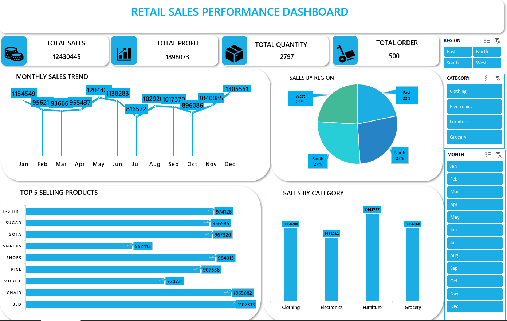

# 🛍️ Retail Sales Excel Dashboard

## 📌 Project Overview
This project analyzes retail sales performance using Microsoft Excel. 
It provides insights into revenue, product performance, regional sales, and payment trends.

## 🛠 Tools Used
- Microsoft Excel
- Pivot Tables
- Pivot Charts
- Slicers
- KPI Cards
- Data Cleaning

## 📊 Key Metrics
- Total Sales
- Total Profit
- Sales by Region
- Top Products
- Monthly Sales Trend

## 📊 Dashboard Preview

## 📂 Files Included
- Retail_Sales_Dashboard.xlsx

